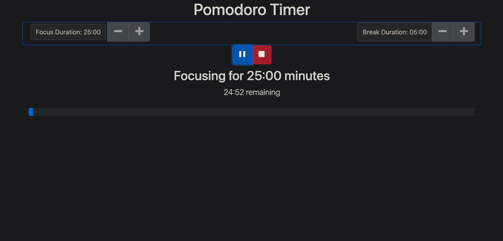

## Project description: Pomodoro timer
The technique uses a timer to break down work into intervals, traditionally 25 minutes in length, separated by short breaks.

Each interval is known as a pomodoro, from the Italian word for tomato, after the tomato-shaped kitchen timer that Cirillo used as a university student.

### Thechnical Overview
An interactive React application that uses buttons and timers, manages the state of the React application, and uses state effectively over multiple components.
